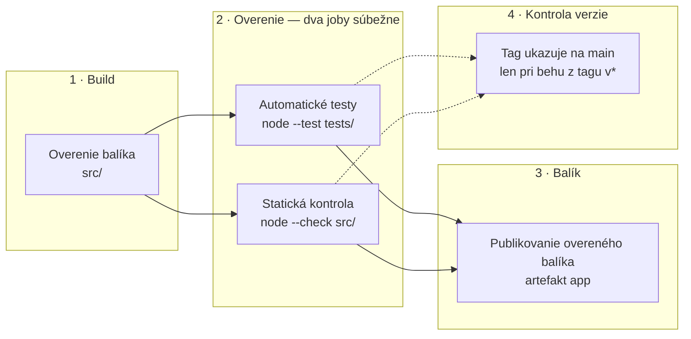

# Insurance Claim Calculator

A small, dependency-free web app for calculating an insurance claim payout from a
set of claim parameters. It runs entirely in the browser — no build step, no
server, no npm install.

## Usage

Open `src/index.html` in a browser.

Fill in the policyholder and claim details, then click **Calculate payout**.

## Project structure

| Path                | Responsibility                                                  |
| ------------------- | --------------------------------------------------------------- |
| `src/index.html`    | Form markup and page layout.                                    |
| `src/style.css`     | Styling.                                                        |
| `src/calc.js`       | Core payout calculation (`InsuranceCalc.calculatePayout`).      |
| `src/app.js`        | UI glue — reads the form, calls the core, renders the result.   |
| `src/hooks/`        | Optional hooks that replace `InsuranceCalc.finalize`.           |
| `tests/`            | Automated tests (`node --test`).                                |
| `ci/`               | Bash scripts the pipeline steps call.                           |
| `azure-pipelines.yml` | The pipeline — see below.                                     |

Everything that ships lives under `src/`, and nothing else does. That is what
lets the pipeline build the package with a plain directory copy: a new file in
`src/` reaches the artifact on its own, and `tests/` and this README stay out of
it without having to be excluded.

The calculation logic (`calc.js`) is deliberately kept separate from the UI glue
(`app.js`) so that changes to the formula only touch `calc.js`.

## Tests

The tests run on the Node.js built-in test runner — no dependencies, no
`npm install`:

```
node --test tests/
```

Each test loads the browser scripts into a fresh `vm` context with a `window`
object, and — for `app.js` — a minimal fake `document`
(`tests/helpers/load.js`). A fresh context per test matters: hooks *replace*
`InsuranceCalc.finalize`, so leaked state would quietly change what is being
measured.

| File                    | Covers                                                     |
| ----------------------- | ---------------------------------------------------------- |
| `tests/calc.test.js`    | The core formula and the `finalize` extension point.        |
| `tests/hooks.test.js`   | Each hook on its own, and the two of them together.         |
| `tests/app.test.js`     | Reading the form, calling the core, rendering the result.   |

Tests named `KNOWN GAP:` pin behaviour that today contradicts what the code
documents. They are there so the behaviour is visible and so a future fix
shows up as a failing test rather than a silent change.

## Pipeline

`azure-pipelines.yml` — four stages, left to right. Everything a stage does is
drawn inside its own container; jobs stacked on top of each other run in
parallel, jobs side by side run one after the other.



`Package` and `VersionCheck` both depend on `Verify` only, so they too run in
parallel — the dashed edges mark `VersionCheck` as conditional: it runs on
tag-triggered runs and is skipped otherwise.

| Stage          | What it does                                                        |
| -------------- | ------------------------------------------------------------------- |
| `Build`        | Checks the required files exist, guards against `type="module"`, publishes `src/` as the artifact. |
| `Verify`       | Two parallel jobs: `node --test tests/` and `node --check` over every script in `src/`. |
| `Package`      | Republishes the verified build as the `app` artifact.               |
| `VersionCheck` | Tag runs only: the tag must be `vX.Y.Z` and point at a commit in `main`. |

The config repo consumes the tag this pipeline verifies.

### `ci/`

Anything longer than a one-liner lives in a script rather than inline in the
YAML, so it can be run and debugged locally — `./ci/test-package-contents.sh` behaves
the same in a shell as it does on the agent. Only the single-line test command
is still inline.

| Script                       | Called by      |
| ---------------------------- | -------------- |
| `test-package-contents.sh`   | `Build`        |
| `test-file-protocol.sh`      | `Build`        |
| `test-javascript-syntax.sh`  | `Verify / lint`|
| `test-release-tag.sh`        | `VersionCheck` |
| `test-node-version.sh`       | `Verify` (both jobs) |

The pipeline installs Node itself: both `Verify` jobs run `NodeTool@0` with
`versionSpec: 20.x`, then `test-node-version.sh` checks that v20 or newer really
ended up on `PATH`. `NodeTool@0` downloads from nodejs.org into the agent's tool
cache (`_work/_tool`), which `workspace: clean: all` does not wipe — so it
downloads once per agent, not once per run. The agents do need to reach
nodejs.org, through the proxy if there is one.

The pipeline runs on Linux agents (`Pool1-Linux`). The steps use `bash`, and
the only thing the agents need installed is **git** — no PowerShell, and
Node comes from `NodeTool@0` (see above). That is deliberate: these agents are on-prem behind a TLS-inspecting
proxy, so every runtime dependency the pipeline adds is something that has to be
installed by hand on each machine and can fail to download. `bash` and
`coreutils` are already on any Linux agent, which makes them the cheapest thing
to depend on.

The trade-off is that the scripts no longer run on a Windows workstation as-is —
debugging them locally means WSL, macOS, or a Linux box.

Each script uses `set -euo pipefail` and takes long options with sensible
defaults (`--source`, `--page`, `--tag`) instead of reading pipeline variables
directly — that is what makes them runnable outside CI.
Failures are reported with `##vso[task.logissue type=error]` and a non-zero
exit code.

## Extending the calculation

`calc.js` exposes a hook extension point, `InsuranceCalc.finalize(payout, context)`,
which by default is a pass-through. A hook can replace this slot to adjust the
final payout:

```js
InsuranceCalc.finalize = function (payout, ctx) {
  // ctx = { input, damage, deductible, base }
  return payout;
};
```

Load any hook script *after* `calc.js`. This slot must be preserved in every
future version of `calc.js` — dropping it would silently disable all hooks.
